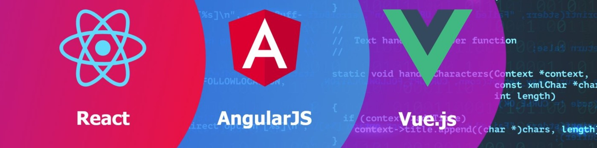

# Hola, mi nombre es Carlos Mur Estudillos 👋
### Senior FrontEnd Software Engineer | Freelance Developer

Soy desarrollador front-end desde 2010, con experiencia en **React, Angular, Vue, Next.js y Svelte**, creando aplicaciones web modernas y herramientas de productividad.

He trabajado en proyectos internacionales y también desarrollo **proyectos personales y open-source** en GitHub, explorando nuevas tecnologías y compartiendo conocimiento con la comunidad.

> ⭐️ [GitHub Stars](https://github.com/cmurestudillos?tab=stars)

> 
> 
> 
> 
> 

## Encuéntrame en:

## 📦 Algunos de mis repositorios

| Repositorio | Descripción / Qué hace | Lenguaje / Tech principal / Notas |
|------------|------------------------|-------------------------------|
| [gestor‑de‑gastos](https://github.com/cmurestudillos/gestor-de-gastos) | App web de gestión de presupuestos personales | React + TypeScript + Vite |
| [cotizador‑de‑criptomonedas](https://github.com/cmurestudillos/cotizador-de-criptomonedas) | Web app para consultar precios de criptomonedas en tiempo real | React + TypeScript + Vite |
| [postman‑clone](https://github.com/cmurestudillos/postman-clone) | Cliente / herramienta para probar APIs | JavaScript |
| [mac‑notepad](https://github.com/cmurestudillos/mac-notepad) | Editor de texto / bloc de notas tipo escritorio | Electron + JavaScript |
| [ssh‑manager](https://github.github.com/cmurestudillos/ssh-manager) | App de escritorio para gestionar conexiones SSH | Electron + JavaScript |
| [code‑editor‑clone](https://github.com/cmurestudillos/code-editor-clone) | Editor de código web con live preview HTML/CSS/JS | React + TypeScript |
| [ant‑vpn](https://github.com/cmurestudillos/ant-vpn) | Aplicación de escritorio para VPN con OpenVPN | Electron + JS + OpenVPN |
| [project‑task‑manager](https://github.com/cmurestudillos/project-task-manager) | Gestor de tareas/proyectos tipo kanban/local | Electron + JS/HTML/CSS |
| [react‑movies‑app](https://github.com/cmurestudillos/react-movies-app) | Buscador de películas usando una API pública | React + JS |
| [codepen‑clone](https://github.com/cmurestudillos/codepen-clone) | Clone web de editor HTML/CSS/JS (tipo CodePen) | React |
| [mevn‑stack](https://github.com/cmurestudillos/mevn-stack) | CRUD full‑stack usando MEVN (Vue + Node/Express) | Vue.js + Node + Express + JS |
| [react‑graficos](https://github.com/cmurestudillos/react-graficos) | Web app para generación de gráficos / visualización | React + Chart.js (u otra librería) |

## Contacto y apoyo
  
